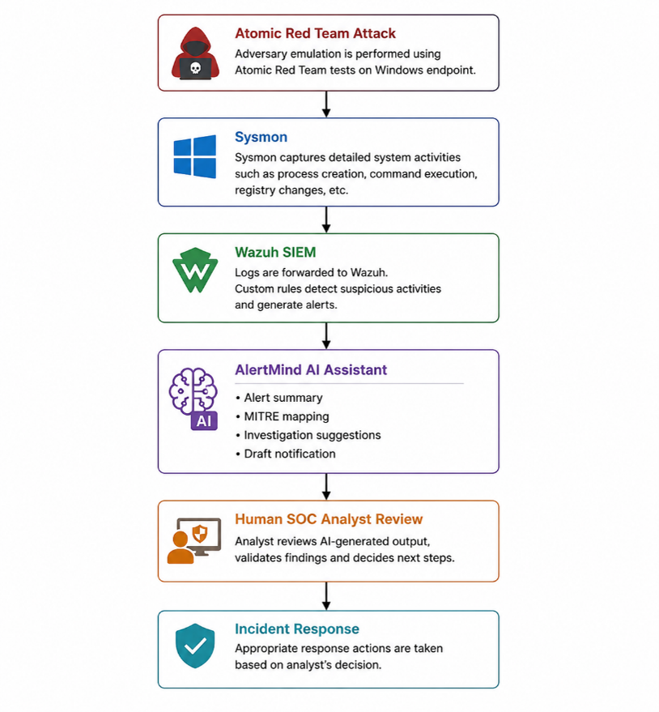
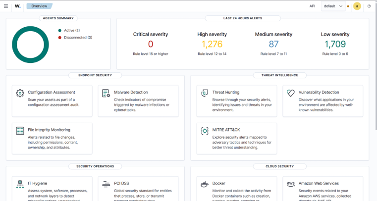
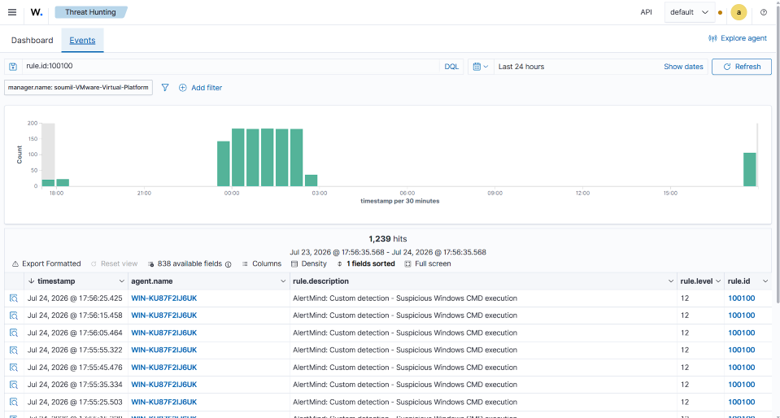
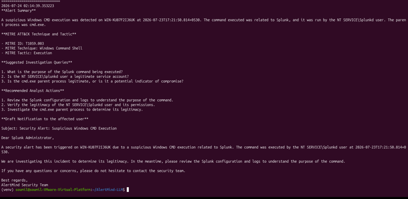

# 🛡️ AlertMind – AI-Assisted Mini Security Operations Centre

> An AI-assisted Security Operations Centre (SOC) prototype integrating **Wazuh SIEM**, **Sysmon**, **LangChain**, and **Llama 3.1 (Groq API)** to enhance security alert triage and improve analyst efficiency.

---

## 📖 Project Overview

AlertMind is an academic capstone project developed as part of the MCA program and the IIT Roorkee Cybersecurity with Generative AI certification. The project demonstrates how Large Language Models (LLMs) can assist Security Operations Center (SOC) analysts by summarizing alerts, mapping them to the MITRE ATT&CK framework, and recommending investigation and response actions.

Unlike traditional SOC environments where analysts manually investigate every alert, AlertMind combines SIEM-based detection with AI-assisted analysis while ensuring that all security decisions remain under human control.

---

## 🎯 Objectives

- Centralize security log collection using Wazuh SIEM
- Detect Windows attacks using custom detection rules
- Map alerts to the MITRE ATT&CK framework
- Prototype an AI-powered Tier-1 SOC Assistant
- Reduce alert fatigue and improve analyst efficiency
- Demonstrate responsible AI through guardrails and human-in-the-loop decision making

---

# 🏗️ System Architecture



---

# ⚙️ Technology Stack

| Category | Technology |
|-----------|------------|
| SIEM | Wazuh |
| Endpoint Monitoring | Sysmon |
| Programming Language | Python |
| LLM Framework | LangChain |
| Large Language Model | Llama 3.1 |
| AI Provider | Groq API |
| Operating Systems | Ubuntu Server, Windows Server 2019 |
| Virtualization | VMware Workstation |
| Detection Framework | MITRE ATT&CK |

---

# ✨ Key Features

- Centralized Security Monitoring using Wazuh
- AI-Assisted Tier-1 SOC Analyst
- 12 Custom Detection Rules
- MITRE ATT&CK Technique Mapping
- Alert Summarization
- Investigation Recommendations
- Draft Incident Notifications
- Prompt Logging
- Response Logging
- AI Guardrails for Safe Responses
- Human-in-the-Loop Decision Making

---

# 🔄 Alert Processing Workflow

```text
Atomic Red Team Attack
           │
           ▼
        Sysmon
           │
           ▼
     Wazuh Agent
           │
           ▼
    Wazuh Manager
           │
           ▼
  Custom Detection Rules
           │
           ▼
    Wazuh Dashboard
           │
           ▼
  AlertMind AI Assistant
           │
           ▼
      SOC Analyst
```

---

# 📸 Project Screenshots

## Architecture


---

## Wazuh Dashboard



---

## Detection Alert



---

## AlertMind AI Analysis



---

# 🚀 Installation

Clone the repository

```bash
git clone https://github.com/Soumil27/AlertMind-AI-Assisted-Mini-SOC.git
cd AlertMind-AI-Assisted-Mini-SOC
```

Create a virtual environment

```bash
python3 -m venv venv
source venv/bin/activate
```

Install dependencies

```bash
pip install -r requirements.txt
```

Create a `.env` file using `.env.example` and add your Groq API key.

Run AlertMind

```bash
python app.py alerts/powershell.json
```

---

# 📄 Documentation

- 📘 **[View IEEE Capstone Report](Final Report.pdf)**
- 📊 **[View Project Presentation](AlertMind_Capstone_Presentation.pptx)**

---

# 🛡️ AI Safety and Guardrails

AlertMind follows a human-in-the-loop approach.

The AI assistant:

- Summarizes security alerts
- Maps alerts to MITRE ATT&CK
- Suggests investigation steps
- Recommends response actions

The AI **does not**:

- Execute commands
- Isolate hosts
- Delete files
- Block users automatically
- Make autonomous security decisions

All recommendations require review and approval by a SOC analyst.

---

# 📌 Future Enhancements

- Live integration with Wazuh API
- Automated SOAR playbooks
- Multi-agent AI architecture
- Threat intelligence enrichment
- Multi-cloud monitoring support
- Interactive SOC dashboard

---

# ⚠️ Disclaimer

This repository is an academic proof-of-concept developed for educational purposes.

The AI assistant provides advisory guidance only. Threat detection is performed by Wazuh SIEM, while all recommendations require validation by a human analyst.

---

#  Author

**Soumil Verma**
